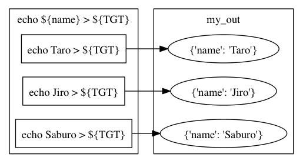
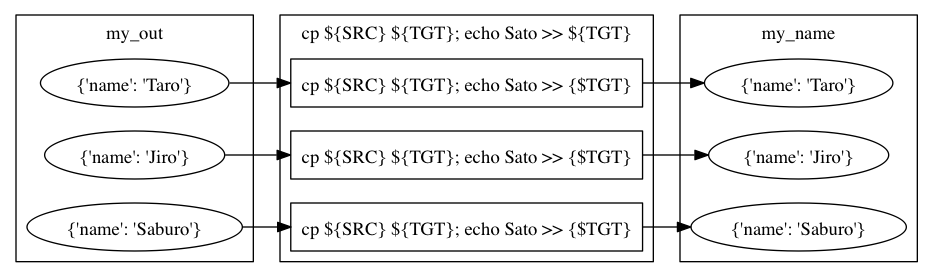
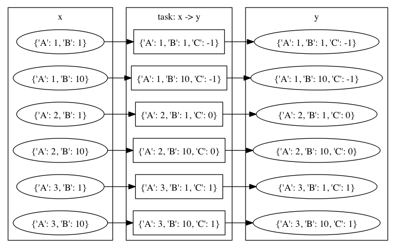
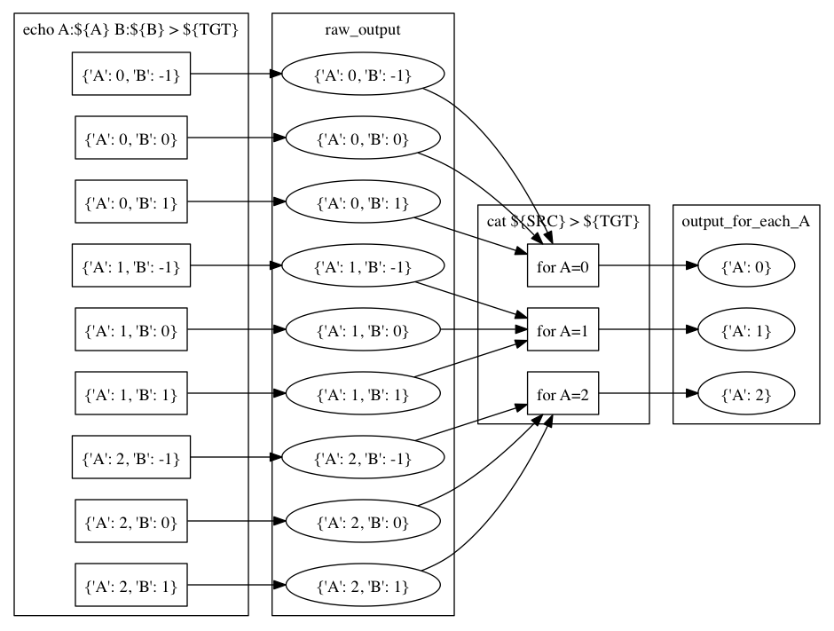

mafの使い方
===========

本章ではmafの諸概念を紹介したあと、具体例を通して便利な機能を紹介していきます。
読者には以下の知識を仮定します。

- Pythonの基本的な使い方
- wafの基本的な使い方

実験の始め方
------------

まずは最も簡単なmafスクリプトを書いて、使い方を学びましょう。
mafのリポジトリ https://github.com/pfi/maf から ``waf`` と ``maf.py`` をダウンロードして、実験用のディレクトリに置きます。
wafファイルには実行可能フラグを立てておくと良いでしょう。

.. code-block:: bash

   $ wget https://github.com/pfi/maf/raw/master/waf
   $ wget https://github.com/pfi/maf/raw/master/maf.py
   $ chmod +x waf

次に以下の内容の ``wscript`` ファイルを作成します。

.. code-block:: python

   import maf

   def configure(conf):
       pass

   def build(exp):
       pass

この ``wscript`` ファイルは何もしません。
通常のwafのビルドと同じように、mafの実験設定も ``build`` 関数内に定義します。
バージョン0.1までは ``experiment`` という専用の関数を使用していました。
現在でも ``experiment`` に関数を定義することができますが、これは非推薦となります。
以降ではこの例のように、 ``build`` の引数として実験を意味する ``exp`` を用いますが、この名前は任意です。
``build`` の中には、mafの実験設定とwafのビルドの設定とを混在させることもできますが、以降は実験設定の記述のみを行っていきます。

まずはこのスクリプトを実行できるか試しましょう。
以下のコマンドを入力します。

.. code-block:: bash

   $ ./waf configure
   $ ./waf

これはwafでビルドするときと同じものです。
``build`` の代わりに ``experiment`` に関数を定義した場合、二つ目のコマンドは ``./waf experiment`` となります。
以上で「何もしない実験」が実行されます。

以降、 ``build`` 関数の中に実験計画を記述していきます。
mafにおいて利用可能なユーティリティが :py:mod:`maflib` モジュール内に用意されていますが、以降ではimport文などは省略します。

次節ではその書き方に入る前に、まずはmafの最重要概念であるメタノードとパラメータについて解説します。

ノードとメタノードとパラメータ
------------------------------

本節ではwafにおけるノードの概念の紹介（復習）と、mafにおいてこれをパラメータと結びつけたメタノードという概念を概説します。
その後、mafにおけるタスクの書き方について、メタノードとパラメータに関わる挙動に焦点を当てて解説します。

wafノード
~~~~~~~~~

wafにおいて、wscript中で参照するファイルやディレクトリのことを **ノード** と呼びます。
ノードは基本的にはファイルに対応しますが、これにバージョン情報やハッシュ値などが紐付けられています。
また、ノードに対応するファイルはビルドディレクトリ（通常は ``build`` という名前を持つ）以下にあることもあれば、ソースディレクトリ（通常は ``waf`` 自身があるディレクトリ）以下にあることもあります。
wafはノード間の依存関係を管理して、自動的にビルドに必要なタスクを生成します。
また、各タスクごとに入力ファイルのバージョン情報やハッシュ値の変化を検出して、再ビルドの際には必要十分な部分だけを再実行します。

.. image:: figures/node.png
   :scale: 75%

メタノード（パラメータ付けられたノード）
~~~~~~~~~~~~~~~~~~~~~~~~~~~~~~~~~~~~~~~~

mafではタスクにパラメータを指定することができます。
例えば次の例では、パラメータごとに異なる内容のファイルを生成しています。

.. code-block:: python

   exp(target='my_out',
       parameters=[{'name': 'Taro'},
                   {'name': 'Jiro'},
                   {'name': 'Saburo'}],
       rule='echo ${name} > ${TGT}')

``parameters`` に辞書の配列を指定することで、タスクにパラメータの集合を設定することができます。
各辞書のキーと値はともにハッシュ化可能でなければなりません。
パラメータの内容は ``rule`` 内で参照することができます。

mafは上の関数呼び出しで、3つの異なるwafタスクを生成します。
これらはパラメータが異なり、出力ファイルも異なります。
各出力ファイルは ``build/my_out`` ディレクトリ以下に生成されます。
ノード ``my_out`` は異なるパラメータに対応する複数のノードを含んでいます。
このノード ``my_out`` のことを **メタノード** と呼びます。

mafではメタノードを一つのノードであるかのように扱うことができます。
例えば ``my_out`` の各ファイルの後ろに特定の文字列を加えるタスクは、以下のように書くことができます。

.. code-block:: python

   exp(source='my_out',
       target='my_name',
       rule='cp ${SRC} ${TGT}; echo Sato >> ${TGT}')

この例の場合、入力ノード ``my_out`` はメタノードなので、各パラメータごとに別々のタスクが生成されます。
どんなパラメータがあるかはメタノード ``my_out`` に紐付けられているので、改めて記述する必要はありません。
このとき、出力ノード ``my_name`` もメタノードとなり、 ``my_out`` に含まれる各ノードに対応するノードがこの中に生成されます。
``my_name`` 内の各ノードには、 ``my_out`` の対応するノードと同じパラメータが紐付けられます。
mafではこのように、パラメータを明示することなくメタノードに対する処理を書くことができます。

メタノードに関するより詳しい仕様
--------------------------------

メタノードとパラメータ指定にはいくつかのバリエーションがあります。
また、実験計画を記述する上では、実験結果を集約する操作も必要になります。
この節ではそれらについて一つずつ解説していきます。

複数パラメータの生成
~~~~~~~~~~~~~~~~~~~~

パラメータは辞書の配列で指定しますが、パラメータの種類が多く、それらの様々な組合せを試したいケースは多いです。
このような場合に、同じ種類のパラメータに対する範囲を何度も書くのはメンテナンスの観点から望ましくありません。
そこでmafにはパラメータの組合せを生成する便利な関数が2つ用意されています。

一つ目は :py:func:`maflib.util.product` です。
各パラメータ名に対するパラメータのリストを指定すると、すべての組合せを生成します。
productという名前は集合の直積を表します。

.. code-block:: python

   maflib.util.product({'method': ['PA2', 'AROW'],
                        'C': [0.1, 1, 10]})
   # => [{'method': 'PA2', 'C': 0.1},
   #     {'method': 'PA2', 'C': 1},
   #     {'method': 'PA2', 'C': 10},
   #     {'method': 'AROW', 'C': 0.1},
   #     {'method': 'AROW', 'C': 1},
   #     {'method': 'AROW', 'C': 10}]
   # (順番が入れ替わる可能性はあります)

もう一つは :py:func:`maflib.util.sample` です。
各パラメータ名に対してパラメータを生成する関数を渡すと、それらを用いて指定した数の組合せを生成します。
関数の代わりに数値の対を渡すとその区間の連続一様分布を用います（始点は含み、終点は含まない）。
関数の代わりに値のリストを渡すと、リストから値を選ぶような離散一様分布を用います。
パラメータの最適化を行う際に、直積集合よりも少ない組合せで効率的に実験を行うのに有効です。

.. code-block:: python

   maflib.util.sample(4, {'A': [1, 2, 3],  # 離散一様分布からサンプリング
                          'B': (0.0, 1.0),  # [0.0, 1.0) の範囲の連続一様分布からサンプリング
                          'C': lambda: math.pow(10, random.uniform(-1, 1))  # サンプリング関数を自分で記述
                          })

.. _metanode_combination:

メタノードの組合せ
~~~~~~~~~~~~~~~~~~

``source`` として複数のメタノードを指定することもできます。
この場合、基本的にはそれらが含むノードの全組み合わせが用いられます。
ただし、組み合わされたノード同士が同じキーで違う値のパラメータを持つ場合、その組合せは無視されます。

例えば次の例を見てみましょう。

.. code-block:: python

   exp(target='x',
       parameters=[{'A': 1, 'B': 1},
                   {'A': 2, 'B': 10},
                   {'A': 3, 'B': 1}],
       rule=...)

   exp(target='y',
       parameters=[{'A': 1, 'C': -1},
                   {'A': 2, 'C': 0},
                   {'A': 3, 'C': 1}],
       rule=...)

   exp(source='x y',
       target='z',
       rule=...)

.. image:: figures/combination.png
   :scale: 75%

パラメータ ``A, B`` を持つメタノード ``x`` と、パラメータ ``A, C`` を持つメタノード ``y`` があり、それらを入力としてメタノード ``z`` を出力しています。
この場合、 ``z`` を出力するタスクでは ``x`` と ``y`` のノードの全組合せが試されますが、そのうちパラメータ ``A`` の値が食い違っている組合せについてはタスクを実行しません。

よって ``z`` は以下のパラメータに対応するノードの集合となります ::

  {'A': 1, 'B': 1, 'C': -1},
  {'A': 2, 'B': 10, 'C': 0},
  {'A': 3, 'B': 1, 'C': 1}.

``x`` も ``y`` も3通りのパラメータを持ちますが、 ``z`` は3×3=9通りではなく、組合せが正しい3通りのみを持っていることに注目してください。

メタノードが入力にある場合のパラメータ指定
~~~~~~~~~~~~~~~~~~~~~~~~~~~~~~~~~~~~~~~~~~

mafでは ``parameters`` を指定することでタスクおよび出力ノードにパラメータを設定できることを見てきました。
パラメータはさらに、入力ノードにメタノードが含まれる場合にも指定することができます。

入力ノードにメタノードがあり、かつ ``parameters`` にパラメータを指定している場合、メタノードのパラメータと ``parameters`` に指定されたパラメータのすべての組合せが試されます。
このとき、同じキーに対して異なる値が対応する組合せについてはスキップします。
この挙動は、前項で解説した、複数メタノードを入力に指定した場合と同じです。

次の例を考えます。

.. code-block:: python

   exp(target='x',
       parameters=maflib.util.product({'A': [1, 2, 3], 'B': [1, 10]}),
       rule=...)

   exp(source='x',
       target='y',
       parameters=[{'A': 1, 'C': -1},
                   {'A': 2, 'C': 0},
                   {'A': 3, 'C': 1}],
       rule=...)

この例ではメタノード ``x`` を入力とするタスク生成で同時に ``parameters`` が指定されています。
このとき出力メタノード ``y`` は以下のパラメータを持つことになります::

  {'A': 1, 'B': 1, 'C': -1},
  {'A': 1, 'B': 10, 'C': -1},
  {'A': 2, 'B': 1, 'C': 0},
  {'A': 2, 'B': 10, 'C': 0},
  {'A': 3, 'B': 1, 'C': 1},
  {'A': 3, 'B': 10, 'C': 1}.

メタノードの集約
~~~~~~~~~~~~~~~~

実験結果を評価するためには、実験の出力を集約する操作が必要になります。
たとえばグラフの描画や、複数回の試行に対して平均をとる操作などがこれにあたります。
mafでは、メタノードが持つ複数のパラメータに対するノード集合に対して一つのノードを出力するようなタスクを **集約タスク** と呼びます。
集約タスクを用いれば、このような集約操作を書くことができます。

.. image:: figures/aggregation_image.png
   :scale: 75%

タスクを書く際に ``for_each`` または ``aggregate_by`` を指定した場合に、そのタスクは集約タスクとなります。
集約する際に、どのパラメータについて集約するかをこれらのキーで選びます。
これらにはパラメータ名のリストを指定します。
集約タスクでは必ず入力ノードにメタノードが含まれていなければなりません。

``for_each`` を指定した場合、そこに列挙されたパラメータ名は、出力メタノードに保存されます。
すなわち、そこに列挙されていないパラメータについて集約を行います。
たとえば次の例をご覧ください。

.. code-block:: python

   exp(target='raw_output',
       parameters=maflib.util.product({'A': [0, 1, 2],
                                       'B': [-1, 0, 1]}),
       rule='echo A:${A} B:${B} > ${TGT}')

   exp(source='raw_output',
       target='output_for_each_A',
       for_each=['A'],
       rule='cat ${SRC} > ${TGT}')

   # 注意: ruleに指定した文字列内で ${SRC} と書いた場合、
   # そこには入力ノードすべてのファイル名がスペース区切りで列挙される。

この例の場合、 ``for_each=['A']`` の指定により、各 ``A`` の値ごとに ``output_for_each_A`` のノードを生成するタスクが実行されます。
すなわち、 ``A`` の値が等しくて ``B`` の値が異なる3つの入力ノードに対して1つのタスクが作られます。
``for_each`` を用いた指定は、残すパラメータが少ない場合に便利です。
すべてのパラメータについて集約を行い、一つのファイルだけを出力したい場合には、 ``for_each`` に空リストを指定します（ ``for_each`` 自体を省略してしまうと、集約タスクになりません）。

一方、 ``aggregate_by`` を指定した場合、逆にそこに列挙されたパラメータについて集約を行います。
すなわち、それ以外のパラメータを ``for_each`` に指定した場合と同じ挙動をします。
次の例は、上の例と等価です。

.. code-block:: python

   exp(target='raw_output',
       parameters=maflib.util.product({'A': [0, 1, 2],
                                       'B': [-1, 0, 1]}),
       rule='echo A:${A} B:${B} > ${TGT}')

   exp(source='raw_output',
       target='output_for_each_A',
       aggregate_by=['B'],
       rule='cat ${SRC} > ${TGT}')

``aggregate_by`` を用いた指定は、集約するパラメータが少ない場合に便利です。

``for_each`` と ``aggregate_by`` を同時に指定することはできません。

ディレクトリに対するメタノード
~~~~~~~~~~~~~~~~~~~~~~~~~~~~~~

これまでの例は全て、一つのパラメータの組み合わせに対応する入力/出力ノードは一つのファイルに対応し、メタノードはそれらを束ねる役割を持ちました。
一方で、異なる種類のファイルを複数含むディレクトリを一つのノードとして扱いたい場合も存在します。
例えば画像処理において、データセットが複数の画像からなる場合や、言語処理において複数の文書からなるコーパスをまとめて扱いたい場合などが考えられます。
またあるソフトは、学習や予測の結果を複数ファイルからなるディレクトリの形で出力する場合も考えられます。

出力ファイルにディレクトリを指定するソフトを用いる場合は特別な変更は必要ありません。

.. code-block:: python

   exp(target='output',
       parameters=maflib.util.product({'A': [0, 1, 2],
                                       'B': [-1, 0, 1]}),
       rule='train -A ${A} -B ${B} -i input_path -o ${TGT}')

ここでの ``train`` は ``-o`` でディレクトリを指定し、各実行毎にディレクトリを作成する仮想的なコマンドです。
この場合通常のタスクと同じように、 ``build`` 以下には、output/0-output/, output/1-output/ ... といった出力が生成されます。

注意が必要なのは、出力ディレクトリを事前に生成しておかなければならない場合です。
例えば上記の ``train`` コマンドが、 ``-o`` に指定したディレクトリが存在しない場合に実行に失敗するとします。
この場合は、次のように明示的にディレクトリを生成する関数ルールを定義し、それを指定する必要があります。
関数ルールは実験タスクをより柔軟に定義するための機能です。詳しくは :ref:`function_rule` を参照してください。

.. code-block:: python

   exp(target='output',
       parameters=maflib.util.product({'A': [0, 1, 2],
                                       'B': [-1, 0, 1]}),
       rule=train)

   @maflib.util.rule
   def train(task):
       task.outputs[0].mkdir()
       subprocess.check_call(['train', '-A', task.parameter['A'], '-B', task.parameter['B'],
                              '-i input_path', '-o', task.outputs[0]])

上記の ``task.outputs[0].mkdir()`` は、出力ノードのパスの位置にディレクトリを生成します。
これによって、事前にディレクトリが存在することが保証されます。

また、関数ルールの中で出力ノードのディレクトリにファイルを追加したい場合もあるかもしれません。
``task.outputs[i]`` はwafの `Nodeクラス <http://docs.waf.googlecode.com/git/apidocs_17/Node.html>`_ のインスタンスになっていて、Nodeクラスに定義されているファイル操作の機能を使うことができます。
今回のようにディレクトリを指すノードに対してその中に新しいファイルを作成する場合、 ``Node.find_or_declare()`` が便利です。
例えば先ほどのタスクで、出力ディレクトリにタスクの実行時間を計測したログファイルを別に出力する場面を考えます。
その場合、 ``train`` を以下のように拡張します。

.. code-block:: python

    @maflib.util.rule
    def train(task):
        task.outputs[0].mkdir()

        import time
        begin = time.clock()
        subprocess.check_call(['train', '-A', task.parameter['A'], '-B', task.parameter['B'],
                              '-i input_path', '-o', task.outputs[0]])            
        sec = time.clock() - begin
        task.outputs[0].find_or_declare("time").write(str(sec))

``task.outputs[0].find_or_declare("time")`` は、出力ディレクトリ内に time という名前のファイルを作成します。
そして ``write`` メソッドにより、その中に計測した実行時間を出力します。

.. _id_table:

パラメータに対するid割り当て
~~~~~~~~~~~~~~~~~~~~~~~~~~~~

mafでは、実行ディレクトリの ``./build`` 以下に実験結果が格納されます。例えば、 :ref:`metanode_combination` で取り上げた実験を行った場合、 ``./build`` 以下には以下のようなファイルが生成されます。

.. code-block:: bash

    .
    ├── x
    │   ├── 0-x
    │   ├── 1-x
    │   └── 2-x
    ├── y
    │   ├── 3-y
    │   ├── 4-y
    │   └── 5-y
    └── z
        ├── 6-z
        ├── 7-z
        └── 8-z

このように、mafを実行すると ``target`` に指定したメタノードに対応するディレクトリが作られ、その中に、パラメータの組み合わせ毎の結果が格納されます。実験結果の可視化を含めて全ての操作をmaf上で行う場合は、このディレクトリ構成については意識する必要はないのですが、得られた各ファイルを直接目で確認したい場合や、他のプログラムで処理を行いたい場合も存在します。各ディレクトリには、 ``0-x`` などのように先頭に数値がついたファイルが生成されますが、この数値は、一つのパラメータの組み合わせに割り当てられたidになっています。そして、このidとパラメータの対応は、./build/.maf_id_table.tsvファイルを参照することにより得ることができます。

.. code-block:: bash

    $ cat ./build/.maf_id_table.tsv
    0       {'A': 1, 'B': 1}
    1       {'A': 2, 'B': 10}
    2       {'A': 3, 'B': 1}
    3       {'A': 1, 'C': -1}
    4       {'A': 2, 'C': 0}
    5       {'A': 3, 'C': 1}
    6       {'A': 2, 'C': 0, 'B': 10}
    7       {'A': 1, 'C': -1, 'B': 1}
    8       {'A': 3, 'C': 1, 'B': 1}

これにより、例えば ``0-x`` は、 ``{'A': 1, 'B': 1}`` というパラメータに対応する実験の出力結果であることが分かります。

JSON形式の入出力ファイル
------------------------

mafのいくつかのユーティリティを活用するには、実験結果などをJSON形式で保存する必要があります。
JSON形式のファイルは、そのまま全体がひとつのJSON値になっているようなテキストファイルです。
mafのユーティリティで用いられるJSONファイルは、一つのオブジェクトまたはオブジェクトの配列です。
各オブジェクトは入れ子構造を持たず、文字列のキーと文字列または数値の値のみを持つことを仮定しています。

たとえば以下のJSONファイルには、mafユーティリティを使って集約やプロット処理を適用できます。

.. code-block:: javascript

   {"A": 1, "B": "abc"}

.. code-block:: javascript

   [
     {"A": 1, "B": "abc"},
     {"A": 2, "B": "def"},
     {"A": 3, "B": "ghi"}
   ]

JSON形式のファイルを用いることで、mafのユーティリティを使って以下の様なことができます。

- 特定のキーについて最大値を取ったり、キーごとに平均を取るなどといった集約処理
- グラフ描画用に、特定のキーに関する値の列を取り出す処理

ルールの書き方
--------------

タスクの具体的な処理内容は **ルール** に書かれます。
タスクにおけるルールの指定は ``rule`` 引数で行います。

.. code-block:: python

   exp(source='A', target='B', rule=...)

mafにおけるルールの書き方は、基本的にはwafのものと同様ですが、ここではwafに詳しくないユーザーも対象として、またmaf特有の書き方にも触れるために、包括的に解説します。

mafにおいてルールには3つの種類があります。

- コマンドルール
- 関数ルール
- ``maflib.core.Rule`` ルール

コマンドルール
~~~~~~~~~~~~~~

コマンドルールは処理をコマンドとして文字列で書いたものです。
このドキュメントでも何度も登場しています。
例えば入力ファイルを出力ファイルにコピーするタスクは以下のように書くことができます。

.. code-block:: python

   exp(source='A', target='B', rule='cp ${SRC} ${TGT}')

コマンドルール内では ``${式}`` の形でpython式を展開することができます。
この式の中では以下のような値を使うことができます。

- 入力ノード配列 ``SRC`` および出力ノード配列 ``TGT`` 。
  ``${SRC}`` のようにそのまま変数展開した場合、入力ノードのパスを空白区切りでつなげた文字列に展開されます。
  N番目の入力ノードの絶対パスを展開したい場合いは ``${SRC[N].abspath()}`` のようにします。
- タスクのパラメータ。
  タスクのパラメータは、入力ノードがメタノードの場合にはそのパラメータを含み、タスク自体にパラメータが指定されている場合はそれも含みます。
  たとえば以下のように直接パラメータを参照することができます。

  .. code-block:: python

     # メタノードxはパラメータaを持つ
     exp(target='x', parameters=[{'a': 1}, {'a': 2}], rule='...')

     # xのパラメータaと、このタスクのパラメータbをコマンドルール内で両方とも参照できる。
     exp(source='x', target='y',
         parameters=[{'b': 100}, {'b': 200}],
         rule='... ${a} ${b} ...')

.. _function_rule:
         
関数ルール
~~~~~~~~~~

関数ルールはpython関数として書かれたルールです。
一つのコマンドで書けないような複雑な処理を行いたい場合に使います。

関数として書かれたルールは、 **タスクオブジェクト** を引数に取ります。
タスクオブジェクトはwafのものと同様ですが、 ``parameter`` メンバーが追加されています。
以下の例で、先頭行の ``@maflib.util.rule`` は必須ではありませんが、書くことが推薦されています。このデコレータの役割については後述します。

.. code-block:: python

   @maflib.util.rule
   def my_rule(task):
       ...

タスクオブジェクトのメンバーでよく使うものを以下に列挙します。

``task.inputs``
    入力ノードのリスト
``task.outputs``
    出力ノードのリスト
``task.parameter``
    タスクのパラメータ辞書

ルールへのパラメータの割り当て
~~~~~~~~~~~~~~~~~~~~~~~~~~~~~~~~

:py:func:`maflib.util.rule` デコレータを用いることにより、ルールに紐づいたパラメータの指定方法が柔軟になります。以下にその例を示します。

.. code-block:: python

   @maflib.util.rule
   def my_rule(task):
       task.outputs[0].write("%s %s" % (task.parameter['a'], task.parameter['b']))

   def build(exp):
       # indicate by argument
       exp(target='t', rule=my_rule(a=1, b=2))

       # indicate by parameter
       exp(target='s', parameters=[{'a': 1, 'b': 2}], rule=my_rule())

       # mixed usage
       exp(target='u', parameters=[{'a': 1}], rule=my_rule(b=2))

       # if no arguments are used, parens can be omitted
       exp(target='r', parameters=[{'a': 1, 'b': 2}], rule=my_rule)

ここで、4つの実験はどれも ``my_rule`` というタスクに対し ``a=1,b=2`` という組み合わせで実行されます。 ``@maflib.util.rule`` が書かれていない場合は、最後の例のように ``rule=my_rule`` という書き方しか許されません。ルールの定義にデコレータを追加することで、 ``rule=my_rule(a=1, b=2)`` のように、そのルールで用いられるパラメータを直接指定することができます。組み合わせを考える必要のないパラメータをこのように指定することで記述を簡略化することができます。

advancedな話題として、このように記述することで、全てのパラメータを ``parameters`` に指定した場合に発生する一部の問題を回避することができます。

``maflib.core.Rule`` ルール
~~~~~~~~~~~~~~~~~~~~~~~~~~~

``maflib.core.Rule`` クラスのインスタンスをルールに指定することもできます。
基本的には関数ルールですが、タスクを再実行するための変化検出の対象とするオブジェクトを追加することができます。

.. code-block:: python

   exp(...,
       rule=maflib.core.Rule(fun=my_fun_rule, dependson=[...]))

コンストラクタの ``dependson`` 引数に追加の依存関係を指定します。
ここには関数を指定することもできます。
関数を指定した場合、その関数の定義を書き換えたときにこのタスクを再実行するようになります（つまりその関数の定義をこのタスクの入力の一部と見なすようになります）。

集約ルールの書き方
~~~~~~~~~~~~~~~~~~

集約ルールを書く場合には :py:func:`maflib.util.aggregator` デコレータが便利です。

.. code-block:: python

   @maflib.util.aggregator
   def my_aggregator(values, outpath, parameter):
       ...

このデコレータを使用するには前述のJSON形式の入力形式を用いる必要があります。
デコレータに渡す関数には以下の引数が渡されます。

``values``
    入力ノードに書かれたJSONオブジェクトがすべて入ったリストです。
    一部または全部の入力ノードがJSONオブジェクトのリストの場合、それらを連結したものが入ります。
    このリストの中身が集約の対象となります。
``outpath``
    出力ノードのパス。
``parameter``
    このタスクのパラメータ。

基本的にはJSONオブジェクトを出力することになります。
関数の戻り値として文字列を返せば、それが出力ノードに書き込まれます。
自分で ``outpath`` にファイルを作って書き込むことができます。
その場合 ``None`` を返すことでデコレータが出力ノードに書き込むのを抑制します。

例として最大値を取る ``maflib.rules.max`` の定義を以下に載せます。
この関数は引数 ``key`` で指定したキーについて最大値を取るルールを返します。
``maflib.core.Rule`` による依存性追加の例にもなっています。

.. code-block:: python

   def max(key):
       # ルール本体
       @maflib.util.aggregator
       def body(values, outpath, parameter):
           max_value = None
           argmax = None
           for value in values:
               if max_value >= value[key]:
                   continue
               max_value = value[key]
               argmax = value
           return json.dumps(argmax)

       return maflib.core.Rule(fun=body, dependson=[max, key])

プロットを行う集約ルールの書き方
~~~~~~~~~~~~~~~~~~~~~~~~~~~~~~~~

集約ルールの中でも結果を可視化するルールを書くのに ``maflib.plot.plot_by`` デコレータを使うことができます。
このデコレータを使うと、上記のJSON形式のデータをmatplotlibでプロットするルールを簡単に書くことができます。

.. code-block:: python

   @maflib.plot.plot_by
   def my_plot(figure, data, parameter):
       ...

デコレータに渡す関数には以下の引数が渡されます。

``figure``
    matplotlibのfigureオブジェクト
``data``
    :py:class:`maflib.plot.PlotData` オブジェクト。これを用いてmatplotlibでプロットするためのリストなどを作ることができる。
``parameter``
    タスクのパラメータ

:py:class:`maflib.plot.PlotData` オブジェクトから2次元プロットを行うには ``get_data_2d`` 関数を使います。

.. code-block:: python

   @maflib.plot.plot_by
   def my_plot(figure, data, parameter):
       # キー 'a', 'b' に対応するリストを取り出す
       x, y = data.get_data_2d('a', 'b')

       # これをプロット
       axes = figure.add_subplot(111)
       axes.plot(x, y)

``get_data_2d`` に ``key`` 引数を指定すると、指定したキーごとに異なるリストを作ることができます。
これは一つのグラフに複数のプロットを書いて比較する場合に有用です。

.. code-block:: python

   @maflib.plot.plot_by
   def my_plot(figure, data, parameter):
       # キー 'k' ごとに 'a', 'b' の値のリストを取り出す。
       # 戻り値は 'k' の値から (x, y) への辞書になっている。
       key_to_xy = data.get_data_2d('a', 'b', key='k')

       # これを 'k' の値ごとにプロット
       axes = figure.add_subplot(111)
       for k in key_to_xy:
           x, y = key_to_xy[k]
           axes.plot(x, y, label=k)

プロットルールの出力ノードには拡張子を付けるのを忘れないで下さい。

.. code-block:: python

   exp(source='a_b_and_k', target='out.png', rule=my_plot)

実験の検証方法
--------------

自分で定義したタスクが想定通りに動くかどうかを確かめるための方法として、mafでは二つの異なる機能を提供します。
一つはtestモジュールで、各タスクが想定通りに動くかどうかを確かめるためのユニットテストを書きやすくします。
また、wscriptに定義した各実験の依存関係が想定されたものであるかを確認するために、依存関係を描画する機能が存在します。

ユニットテスト
~~~~~~~~~~~~~~~

``maflib.test`` モジュールは、mafの実験に関連したユニットテストを書きやすくするための機能を提供します。

次の自作のルールは、二つの入力ファイルを読み込み、それらを多クラス分類器の結果として精度を出力する関数ルールです。

.. code-block:: python

   def multiclass_accuracy(task):
       gold_labels = [l for l in open(task.inputs[0].abspath())]
       pred_labels = [l for l in open(task.inputs[1].abspath())]
       # Comparing gold_labels and pred_lables
       num_correct = len(filter(lambda x: x[0] == x[1], zip(gold_labels, pred_labels)))
       task.outputs[0].write(str(float(num_correct) / len(gold_labels)))

しかしながら、この関数の入力は ``waflib.Task.Task`` クラスのインスタンスであるため、wafからの呼び出しではなくこの関数を切り離して動作をテストすることが困難です。
:py:class:`maflib.test.TestTask` はこの問題を緩和するためのクラスです。
次に具体例を示します。

.. code-block:: python

   import unittest
   class TestMyRule(unittest.TestCase):
       def test_multiclass_accuracy(self):
           task = maflib.test.TestTask()
           task.set_input(0, "0\n1\n1\n2\n") # gold labels:      [0, 1, 1, 2]
           task.set_input(1, "0\n2\n1\n2\n") # predicted labels: [0, 2, 1, 2]

           multiclass_accuracy(task) # execute the task

           self.assertEqual(task.outputs[0].read(), "0.75")

``unittest.TestCase`` はpythonの `unittestモジュール <http://docs.python.jp/2/library/unittest.html>`_ のクラスで、これを継承することで自作のユニットテストを定義することができます。
``test_multiclass_accuracy()`` が実際のテストの定義です。
この関数は基本的に、 ``multiclass_accuracy(task)`` に渡すための変数 ``task`` を最初に準備し、関数ルールを実行し、望む出力が得られるかをチェックします。
この ``task`` 変数は :py:class:`maflib.test.TestTask` クラスのインスタンスになっており、これが自作の関数ルールをwafから切り離してテストするための機能を提供します。
例えば ``TestTask.set_input(i, str)`` は引数に与えた文字列 ``str`` を ``task.inputs[i].abspath()`` に対応するファイルに出力するので、テストしたい関数への入力を自由に設定することができます。

このようにテストを定義したとして、これをどのように実行すれば良いでしょうか。
:py:class:`maflib.test.ExpTestContext` はテストの実行を簡単にするための機能を提供します。
wscriptに以下を追加してください。

.. code-block:: python

   import maflib.test
   def exptest(test):
       test.add(TestMyRule)

そして以下のコマンドを実行します。

.. code-block:: bash

   $ ./waf exptest
   test_multiclass_accuracy (wscript.TestMyRule) ... ok

   ----------------------------------------------------------------------
   Ran 1 test in 0.008s

   OK

wscriptに ``exptest()`` が定義されていれば、 ``./waf exptest`` によってテストを実行することができます。
テストの追加には様々な方法があります。
ここではクラス名を指定することでテストを追加する方法を示しました。
その他に、ファイル名、もしくはディレクトリ名を指定することができます。
ディレクトリ名を指定する場合、検索対象となるファイルは、先頭が ``test`` から始まるファイルに限定されます（ ``test_rules.py``, ``test_core.py`` など）。

例として、mafの `レポジトリ <https://github.com/pfi/maf>`_ に含まれている一連のテストを実行してみましょう。

.. code-block:: bash

   $ git clone https://github.com/pfi/maf.git
   $ cd maf

次のwscriptを用意します。

.. code-block:: python

   import maf
   import maflib.test
   
   def exptest(test):
       test.add("tests") # add all tests in this directory
       test.add("samples/vowpal/test_vowpal_util.py") # add all tests in this file

``./waf exptest`` を実行すると、 `testsディレクトリ <https://github.com/pfi/maf/tree/master/tests>`_ 及び、 `samples/vowpal/test_vowpal_util.py <https://github.com/pfi/maf/blob/master/samples/vowpal/test_vowpal_util.py>`_ に定義されている全てのテストを実行することができます。

依存関係の描画
~~~~~~~~~~~~~~~

wscriptに定義した実験手順が複雑になってくると、実験の流れが正しく定義されているのかを検証することが難しくなってきます。自分で定義した実験の正しさを検証するためのツールとして、mafでは、各実験の依存関係をグラフにして描画する機能を提供します。

例として、 :ref:`metanode_combination` で定義した実験のグラフを描画してみましょう。以下のwscriptで、各ruleは単にパラメータの組み合わせを出力するだけであり、特に意味はありません。

.. code-block:: python

   exp(target='x',
       parameters=[{'A': 1, 'B': 1},
                   {'A': 2, 'B': 10},
                   {'A': 3, 'B': 1}],
       rule="echo ${A} ${B} > ${TGT}")

   exp(target='y',
       parameters=[{'A': 1, 'C': -1},
                   {'A': 2, 'C': 0},
                   {'A': 3, 'C': 1}],
       rule="echo ${A} ${C} > ${TGT}")

   exp(source='x y',
       target='z',
       rule="echo ${A} ${B} ${C} > ${TGT}")

以下のコマンドを実行することで、graph.pdfというファイルが作られます。

.. code-block:: bash

   $ ./waf graph

これは、以下のように実験に伴う全てのノード間の依存関係を描画したものになっています。黒丸は一つのタスクを表します。これを見ることにより、例えば最後の ``target='z'`` の実験は三つのタスクからなり、 ``x`` と ``y`` の間で ``A`` の値を共有するノードを組み合わせて実験が行われる、ということを、視覚的に確かめることができます。

.. image:: figures/maf_graph_example.png
   :scale: 75%

現在の問題点として、一つの実験におけるパラメータの組み合わせが膨大であるとき、グラフが非常に複雑になり見づらいという点が挙げられます。例えばsamples/liblinearのwscriptに対して、グラフを描画してみてください。ノード数が膨大になり非常に見づらくなる場合、一つの解決策はパラメータの組み合わせを一時的に減らすようにwscriptを書き換えることです。例えば ``maflib.util.product`` を使っている場合、各パラメータの候補数を減らすことでグラフを見やすくすることができます。

``./waf graph`` を実行する際、以下のような引数によりその挙動を変更することができます。

``--simple_param``
   各ノード上の出力として、パラメータの組み合わせの代わりに、その組み合わせのidが使われます（ :ref:`metanode_combination` を参照）。一つのノードに用いられるパラメータの数が大きい場合には、この機能によりシンプルなグラフを描画することができます。

``--graphpath=...``
   出力ファイルのパスを指定します。また、拡張子によって出力フォーマットを変更することができます。例えば ``--graphpath=graph.png`` とすれば、pdfの代わりに画像ファイルが得られます。また、 ``graph.dot`` などのように ``dot`` 拡張子を指定した場合、グラフ描画に使われたgraphvizへの入力ファイルを得ることができます。

その他の例
----------

mafの使用例は https://github.com/pfi/maf/tree/master/samples にまとまっています。
